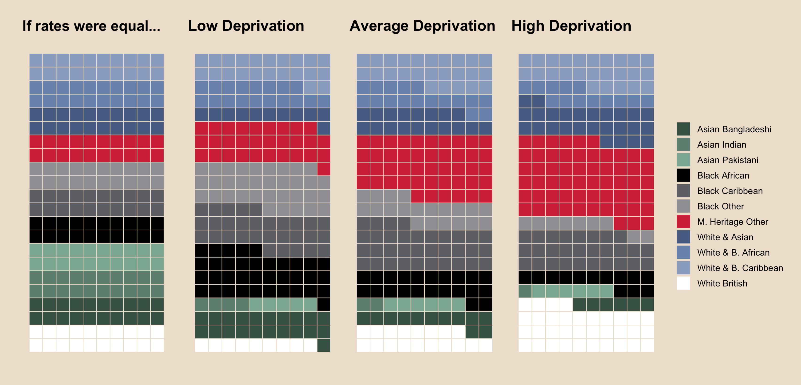
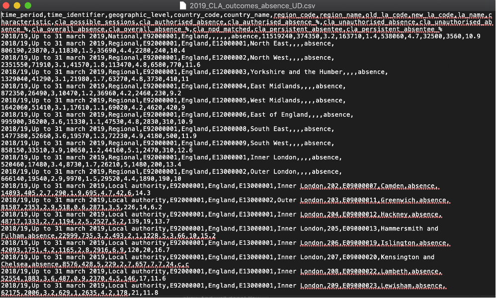
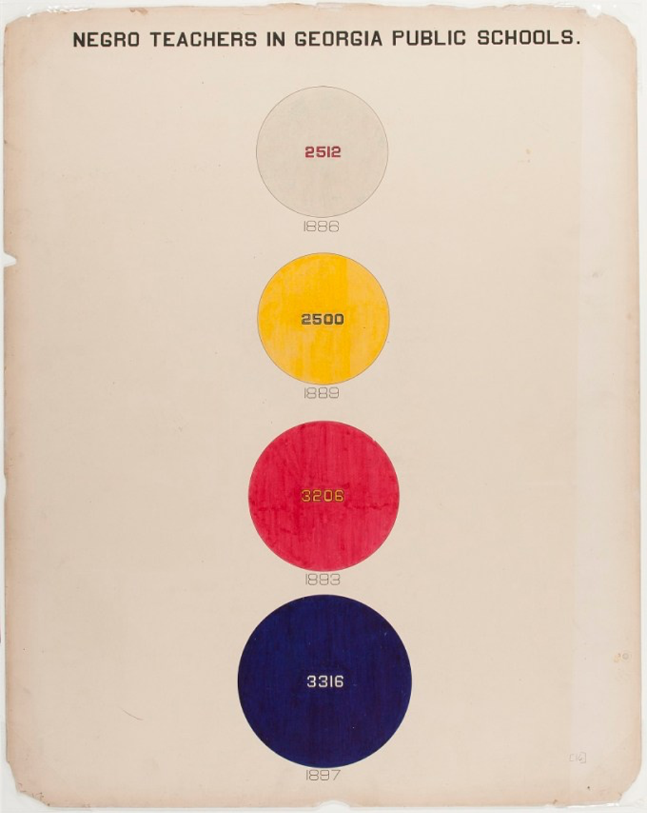

class: hide_logo, bottom
background-image: url(images/cwip_illustration4x3.png)
background-size: contain


```{r setup, include=FALSE}
library(xaringan)
library(xaringanthemer)
library(xaringanExtra)
library(tidyverse)
library(plotly)
options(htmltools.dir.version = FALSE)
```

```{r xaringan-logo, echo=FALSE}
xaringanExtra::use_logo(
  image_url = "images/uni-sheffield.png",
  exclude_class = c("inverse", "hide_logo")
)
```

```{r xaringan-themer, include=FALSE, warning=FALSE}
library(xaringanthemer)
style_duo_accent(primary_color = "#00775A", secondary_color = "#F8C500",
                    header_font_google = google_font("Yanone Kaffeesatz", "300"),
                    text_font_google   = google_font("Noto Sans", "200"),
                    code_font_google   = google_font("IBM Plex Mono"),
                 colors = c(
                   white = "#FFFFFF",
                   black = "#000000",
                   yellow = "#F8C500"
                 ),
                 text_font_size = "1.25rem"
                 )
```

```{r, load_refs, include=FALSE, cache=FALSE}
library(RefManageR)
BibOptions(check.entries = FALSE,
           bib.style = "authoryear",
           cite.style = "alphabetic",
           style = "markdown",
           hyperlink = FALSE,
           dashed = FALSE)
bibliography <- ReadBib("/Users/calumwebb/Google Drive/Social Work Resources/data_resources/biblio.bib", check = FALSE)
```

## .inverse[.white[Curiosity driven, accessible tools for democratising data: social work and children’s services]]

### .inverse[.white[Dr. Calum Webb]]
.white[The University of Sheffield]


---

# Contents

### - <span style="color:black">No one wants to be average; making quantitative social research count.</span>

--

### - <span style="color:black">A demonstration of the Child Welfare Inequalities Project `shiny` app.</span>

--

### - <span style="color:black">Asking out own questions; getting out own answers. Democratising data storytelling.</span>


---
### Children in the poorest 10 per cent of neighbourhoods<br>are more than 10 times as likely to be living in care than children in the least poor 10 per cent of neighbourhoods.

```{r bywaters2020child, echo=FALSE, warning=FALSE, out.width="100%", out.height=400, fig.cap="Data from Bywaters, et al. <a href = https://pure.hud.ac.uk/en/publications/the-child-welfare-inequalities-project-final-report>2020</a>"}

cwi_rates <- tibble(depr = c(1, 2, 3, 4, 5, 6, 7, 8, 9, 10, 1, 2, 3, 4, 5, 6, 7, 8, 9, 10),
                    cpp = c(9, 14, 21, 23, 32, 35, 47, 51, 71, 113, 1, 5, 8, 13, 17, 33, 39, 55, 74, 114), 
                    cla = c(12, 14, 23, 29, 29, 40, 55, 67, 88, 133, 7, 12, 16, 22, 31, 39, 54, 63, 108, 165),
                    country = c(rep("England", 10), rep("Wales", 10)))
        
cpp_plot <- cwi_rates %>%
  ggplot() +
  geom_bar(aes(x = as.factor(depr), y = cpp, group = country, fill = country, text = paste("CPP rate:", cpp, "per 10,000 -", country)), stat = "identity", position = "dodge") +
  ggtitle(str_wrap("", 80)) +
  scale_fill_manual(values = c("#00997B", "#F8C500")) +
  ylab("Child Protection Plans per 10,000 Children") +
  xlab("Deprivation Decile of Neighbourhoods (10 = Most Deprived)") +
  ggeasy::easy_add_legend_title("Country") +
  theme_minimal() +
  theme(plot.title = element_text(face = "bold"))

ratesplot <- ggplotly(cpp_plot, tooltip = "text") %>% config(displayModeBar = F)

widgetframe::frameWidget(ratesplot)

```

---

### There are significant ethnic inequalities in intervention<br>rates, but these are intersectional, where many groups are under-represented in the poorest neighbourhoods and over-represented in the most affluent.

<center>

```{r ethnicity_plot, echo=FALSE, fig.cap="What would the ethnic profile of 220 children looked after look like in differently deprived neighbourhoods if all neighbourhoods had identical sized ethnic populations? From Webb, et al. <a href = https://doi.org/10.1016/j.childyouth.2020.105299>2020</a>", out.height=300, out.width=600}



```

</center>


---

### The most deprived local authorities have seen a much<br>larger reduction in their non-safeguarding, non-children looked after expenditure as a result of austerity.

```{r spending_plot, echo=FALSE, out.width="100%", out.height="400", fig.cap="Data from <a href=https://www.gov.uk/government/collections/section-251-materials>S251 Outturns, DfE 2011-2020</a>."}

spend_plot <- readr::read_rds("csc_data_spend_imd.rds") %>%
  pivot_wider(names_from = "description", values_from = "value") %>%
  janitor::clean_names() %>%
  dplyr::rename(exp_cla = 4, exp_sg = 5, exp_eh = 6, pop = 7, imd = 8) %>%
  mutate(exp_cla = (exp_cla*100000) / pop,
         imd_tertile = as.factor(dplyr::ntile(x = imd, n = 3))) %>% # 3 = most deprived
  group_by(imd_tertile, year) %>%
  summarise_at(vars(exp_cla:exp_eh), ~round(median(., na.rm = TRUE), 1)) %>%
  ungroup() %>%
  pivot_longer(cols = exp_cla:exp_eh, names_to = "spending", values_to = "value_per_child") %>%
  mutate(spending = case_when(spending == "exp_cla" ~ "Looked-after", 
                              spending == "exp_sg" ~ "Safeguarding",
                              spending == "exp_eh" ~ "Early Help etc.") %>% 
           fct_relevel(., c("Looked-after", "Early Help etc.", "Safeguarding")),
         imd_tertile = fct_recode(imd_tertile, "Least Deprived 50 LAs" = "1", "Average 50 LAs" = "2", "Most Deprived 50 LAs" = "3")) %>%
  ggplot() +
  geom_area(aes(x = year, y = value_per_child, fill = spending)) +
  facet_wrap(vars(imd_tertile)) +
  ggeasy::easy_add_legend_title("\n\nSpending\nCategory") +
  ggplot2::theme_minimal() +
  scale_xaringan_fill_discrete() +
  xlab("") +
  ylab("Median Spending per Child") +
  scale_x_continuous(breaks = seq(2011, 2019, 2)) +
  theme(axis.text.x = element_text(angle = 45))

spend_plot <- ggplotly(spend_plot) %>% config(displayModeBar = F)

widgetframe::frameWidget(spend_plot)

```

---

## We have the research, why build an app?

### Some typical reponses from people that can turn that research into change that affects peoples' lives:

<p style="text-align:right";>
`r fontawesome::fa("quote-right", height = 30, fill = "F8C500")`
</p>

--

> ####"But that's not happening here. We're an outlier."

--

> ####"I believe it, but we can't do anything about it if we can't evidence it to our DCS"

--

> ####"I really liked your paper/tweet/blog about [...] - could you get me the data about [local authority] specifically?"

---

class: hide_logo, center, middle
background-image: url(images/web_copy_swings_photo.png)

<br><br><br><br>

# .white[The Child Welfare Inequalities Project App (CWIP App)]
## .white.bg-yellow[[www.cwip-app.co.uk](www.cwip-app.co.uk)]

???

Live demonstration

---

# Democratising data storytelling

<br>

<p style="text-align:right";>
`r fontawesome::fa("quote-right", height = 30, fill = "F8C500")`
</p>


> # <span style="color:black">"the ability to take data — to be able to understand it, to process it, to extract value from it, to visualise it, to communicate it"</span>

.right[Prof Hal Varian, Chief Economist at Google & Emeritus Professor at Berkeley</b>]

---

# Why does everyone need access to<br>data storytelling?

- Stories that include a data narrative are **powerful rhetorical tools**.

- There is **inequitable access** to data and the skills required to turn raw data into visualisations, models, and interfaces that tell data stories.

- This means that many data stories go unheard or, at best, are **filtered through another actor** (e.g. a research institute, news provider). This kind of exclusion is usually associated with other kinds of exclusion.

- 'One dataset, many analysts': it's **good for science and society** (Silberzahn, et al. 2018)


???

Stories that include a data narrative are powerful rhetorical tools, by which I mean they are very good for convincing people of what the writer wants to convince them of, because the numbers in the story often make the story sound much more legitimate - even if the numbers and their interpretations are wrong. In fact, it's quite common for people to dismiss any truth in a story because it's not 'backed up by numbers.' In a fight between a 'data story' and any other kind of story, the data story usually wins.


---


# Democratising data storytelling:<br>Availability

The first, and most basic step of democratising access to data and the ability to tell stories with data is availability. In some ways, there is a lot of progress being made on this. 

> ### <span style="color:black">No one can tell stories with data if they can't get their hands on the data.</span> 

However, despite growing availability of data and resources to learn basic and even advanced data science, translating that data into a story can be a daunting and time consuming task - especially for someone who is trying to tell a story, not make data science their full time job!

---

class: hide_logo, middle




---

# Democratising data storytelling:<br>Participation

.pull-left[
<font size = 4>Social research that made use of data science is actually one of the earliest progenitors of <b>participatory action research</b>.</font>
<br><br>
<font size = 4>W.E.B. Du Bois created data visualisations that showed the growing prosperity and strengths of the African American community at the 1900 Paris exhibition by working together with members of his community to pursue the kinds of research and data representations they wanted and felt was important. This was in opposition to the racist deficit-focused narratives they faced (Battle-Baptiste, et al. 2018).</font>
]

.pull-right[]

---

# Democratising data storytelling:<br> Accessibility

Just because something is **available**, or that people have been invited to **participate**, doesn't mean that what is produced is **accessible**. But what does accessible mean in this context?

--

> Accessibility and full participation is being involved in every step, as far as possible. In data storytelling it means not just availability of data or participation in the creation of a data story. **It's about being able to ask and answer the questions that matter to you**.

--

**A social model of data storytelling?** What are the barriers stopping people from being able to create their own data stories and what tools do we have at our disposal to make data storytelling accessible.


---

## Asking our own questions; getting our own<br>answers.

```{r diagram, echo=FALSE, out.width="100%"}

DiagrammeR::grViz("digraph {
                  
                  graph[layout = dot, rankdir = LR]
                  
                  availability[label='Availability', height=1.5, width=1.5, style='filled', fillcolor='PaleGreen', color='White', fontname='Futura']
                  participation[label='Participation', height=1.5, width=1.5, style='filled', fillcolor='PaleGreen', color='White', fontname='Futura']
                  accessibility[label='Accessibility', height=1.5, width=1.5, style='filled', fillcolor='PaleGreen', color='White', fontname='Futura']
                  
                  availability -> participation -> accessibility -> availability [dir = 'both']
                  
                  }")

```


---

# References

```{r citations, include=FALSE}

RefManageR::NoCite(bibliography, c(
  "bywaters2020child",
  "webb2020cuts",
  "webb2018austerity",
  "silberzahn2018many",
  "battle2018web"))

```

```{r refs, echo=FALSE, results="asis"}
PrintBibliography(bibliography, start = 1, end = 3)
```

---

# References, cont.

```{r refs-2, echo=FALSE, results="asis"}
PrintBibliography(bibliography, start = 4)
```

Presentation created using `xaringan` package. Presentation and code: [https://github.com/cjrwebb/curiosity-data-talk](https://github.com/cjrwebb/curiosity-data-talk)